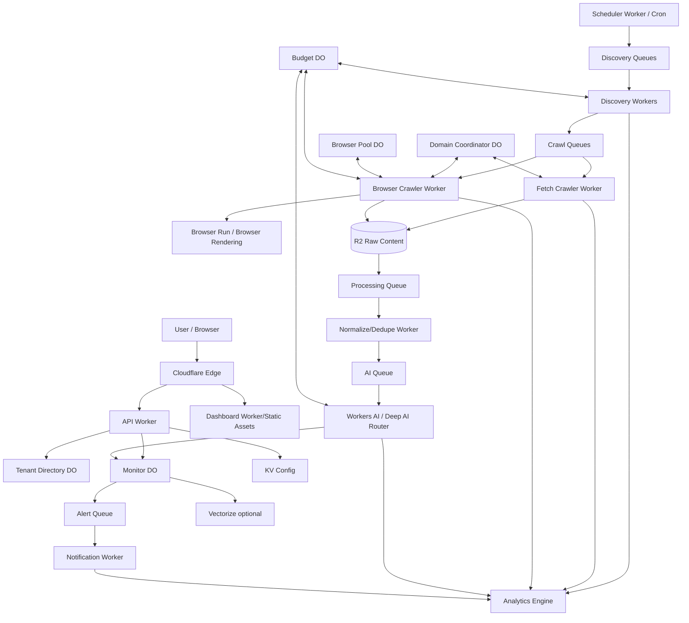

# Technical Architecture & Implementation Specification

## 1. Objective

Build a commercial, multi-tenant social listening SaaS for individuals and businesses. Customers create monitors for names, brands, products, domains, usernames, or Boolean queries. The platform continuously discovers and collects public online mentions, ranks relevance, classifies sentiment toward the monitored entity, scores negative severity, and alerts customers about important negative mentions with a P95 end-to-end detection target below 15 minutes.

Core user promise:

> Know who is talking about you, what they are saying, and be alerted when something negative happens.

## 2. Architectural principles

1. **Cloudflare-native first.** Prefer Workers, Durable Objects, R2, Queues, Workflows, Workers AI, KV, Vectorize, Analytics Engine, Browser Run/Browser Rendering.
2. **Fetch first, browser second.** Use normal HTTP fetch for static/simple sources. Escalate to Browser Run only when JavaScript rendering, scrolling, navigation, or dynamic extraction is required.
3. **Crawl once, match many.** Canonical public content should be fetched once and then matched against many tenant monitors.
4. **Separate global content from tenant intelligence.** Raw source content is global/canonical in R2; customer-specific relevance, sentiment, alert state, and feedback live in monitor-scoped state.
5. **DOs are shards, not one database.** Use SQLite-backed Durable Objects for strongly consistent partitions by tenant, monitor, domain coordinator, budget, or browser pool.
6. **Async by default.** Discovery, crawling, processing, AI, clustering, and notifications flow through queues.
7. **Cheap-first AI.** Deterministic and cheap classifiers eliminate noise before deeper model calls.
8. **Idempotency everywhere.** Every job can be retried safely.
9. **Policy-aware adapters.** Each external source has an explicit capability matrix and supported access method. Never design around bypassing login, bot controls, CAPTCHA, or private content.

## 3. High-level system



## 4. Repository shape

```text
/apps
  /dashboard
  /api-worker

/workers
  /scheduler
  /discovery
  /crawler-fetch
  /crawler-browser
  /processor
  /ai-classifier
  /alerts
  /reports

/durable-objects
  /tenant-directory
  /monitor
  /domain-coordinator
  /browser-pool
  /budget

/packages
  /auth
  /boolean-query
  /source-adapters
  /crawler-core
  /normalization
  /dedup
  /sentiment
  /severity
  /types
  /observability
  /policy

/docs
  TECHNICAL_SPEC.md
  DATA_MODEL.md
  CRAWLER_AND_SOURCES.md
  QUEUE_CONTRACTS.md
  SRE_RUNBOOK.md
  IMPLEMENTATION_ROADMAP.md
```

## 5. Multi-tenant model

Hierarchy:

```text
User
  -> Workspace/Tenant
      -> Memberships/Roles
      -> Monitors
          -> Boolean Queries
          -> Source States
          -> Mentions
          -> Alerts
          -> Feedback
```

Roles V1:
- owner
- admin
- analyst
- viewer

Tenant isolation rules:
- Tenant ID is resolved from authenticated session, never trusted from a browser-provided field alone.
- Every API route scopes to tenant before resolving a monitor.
- R2 tenant-specific artifacts use tenant-scoped prefixes.
- Global raw-content objects must contain no tenant secrets.
- Monitor DO IDs must be derived from server-side tenant + monitor identifiers.

## 6. Durable Object layout

### 6.1 TenantDirectoryDO
Owns:
- tenant metadata
- memberships summary/cache
- monitor directory
- plan/feature references
- tenant-level settings

Does not own:
- raw content
- all mentions for every monitor

### 6.2 MonitorDO
Shard key:

```text
sha256(tenantId + ':' + monitorId)
```

Owns:
- monitor configuration
- Boolean queries
- source cursors
- next scan time
- mentions metadata/indexes
- sentiment/severity outputs
- alert state
- feedback
- aggregation counters
- scan checkpoints

### 6.3 DomainCoordinatorDO
Shard key: registrable domain.

Owns:
- next allowed crawl time
- in-flight count
- backoff state
- recent 429/403/error rate
- robots/policy cache reference
- domain crawl budget

Purpose: avoid a thundering herd when many monitors need the same site.

### 6.4 BrowserPoolDO
Owns only coordination:
- browser concurrency leases
- session reuse metadata
- per-domain browser rate limits
- cooldown state

It must not become a content store.

### 6.5 BudgetDO
Shard key: tenant.

Owns strongly consistent monthly usage counters:
- crawl requests
- Browser Run/browser minutes
- AI inference units
- mentions processed
- notifications
- storage quota estimates

## 7. R2 layout

Buckets:

```text
raw-content-{env}
media-{env}
reports-{env}
exports-{env}
```

Canonical raw content key:

```text
content/{sha256(canonicalUrl)}/{contentVersion}/raw.json
content/{sha256(canonicalUrl)}/{contentVersion}/page.html
content/{sha256(canonicalUrl)}/{contentVersion}/screenshot.webp
```

Tenant reports:

```text
tenants/{tenantId}/reports/YYYY/MM/DD/{reportId}.json
```

Raw content is immutable by content version. A new crawl snapshot creates a new version key.

## 8. Discovery subsystem

Discovery and crawling are different concerns.

Discovery outputs candidate URLs or platform-native content IDs.

Provider interface:

```ts
export interface DiscoveryProvider {
  readonly id: string;
  readonly source: SourceType;
  readonly capabilities: DiscoveryCapabilities;

  discover(input: DiscoveryInput): Promise<DiscoveryResult[]>;
}
```

Discovery sources:
- search providers
- RSS/Atom
- sitemaps
- known-domain crawling
- news feeds/providers
- public social/search adapters
- YouTube/public video discovery
- Reddit public search/feeds where supported
- X/public endpoints or providers where supported
- TikTok public/approved access paths where supported
- Facebook public/approved access paths where supported
- LinkedIn public/approved access paths where supported

Each adapter must explicitly declare whether it supports:
- search
- direct URL fetch
- comments
- engagement metrics
- author metadata
- publish timestamp
- pagination
- historical discovery
- delta cursor
- Browser Run fallback

## 9. Boolean query engine

V1 grammar:

```text
expr        := orExpr
orExpr      := andExpr (OR andExpr)*
andExpr     := unaryExpr ((AND)? unaryExpr)*
unaryExpr   := NOT unaryExpr | primary
primary     := PHRASE | TERM | '(' expr ')'
```

Supported:
- AND
- OR
- NOT
- parentheses
- exact phrase with double quotes

Example:

```text
("ABC Company" OR "ABC Vietnam") AND (refund OR "hoàn tiền") NOT "ABC School"
```

Compile stages:
1. tokenize
2. parse AST
3. validate
4. normalize terms
5. produce provider-specific discovery queries
6. retain original AST for post-fetch exact evaluation

Important: external providers may implement Boolean semantics differently. Provider query generation is only for discovery. Final truth is determined by our own Boolean evaluator against normalized fetched content.

## 10. Crawl decision engine

Input: candidate URL/source record.

Decision:

```text
1. validate URL + SSRF policy
2. check canonical crawl cache
3. check source adapter preference
4. try direct HTTP fetch
5. assess extraction quality
6. if insufficient and allowed -> Browser Run/browser rendering
7. normalize content
8. persist raw snapshot to R2
9. emit process job
```

Direct fetch quality indicators:
- status 2xx
- content-type expected
- minimum meaningful text length
- no obvious JS shell-only page
- title/main content extracted
- not blocked/interstitial

Browser fallback indicators:
- SPA shell
- dynamic content placeholder
- required scroll/load-more
- data only available after JS
- adapter explicitly requires browser mode

## 11. Browser Run usage

Browser mode must be controlled because it is slower and costlier than direct fetch.

Use browser for:
- JS-rendered pages
- dynamic pagination
- load-more interactions
- visible public pages requiring browser rendering
- extracting rendered text/metadata when fetch is insufficient

Do not use browser for:
- simple RSS
- static news HTML
- JSON APIs
- pages already cached with fresh canonical content

Browser worker responsibilities:
- acquire BrowserPoolDO lease
- acquire DomainCoordinatorDO permission
- execute bounded navigation
- bounded scrolling/actions
- extract canonical URL, text, timestamp, author, engagement when available
- optionally store screenshot for debugging/high-risk mentions
- release lease in finally block

## 12. Canonical content model

A public item is represented once as CanonicalContent.

```ts
interface CanonicalContent {
  contentId: string;
  source: SourceType;
  canonicalUrl: string;
  sourceNativeId?: string;
  author?: NormalizedAuthor;
  title?: string;
  text: string;
  publishedAt?: string;
  discoveredAt: string;
  engagement?: EngagementSnapshot;
  language?: string;
  rawR2Key: string;
  fingerprint: string;
  version: string;
}
```

Then monitor-specific Mention records point to contentId.

This enables crawl-once-match-many.

## 13. Deduplication

Order:
1. source-native ID match
2. canonical URL match
3. normalized URL hash
4. exact content hash
5. near-duplicate fingerprint (SimHash/MinHash)
6. optional Vectorize semantic similarity

Tracking parameters removed from canonical URL:
- utm_*
- fbclid
- gclid
- common click IDs
- adapter-specific tracking parameters

## 14. Matching pipeline

For each canonical content item, candidate monitors are selected using an inverted keyword/alias index or source-specific monitor candidates.

Per monitor:

```text
Boolean evaluator
  -> deterministic relevance rules
  -> cheap relevance classifier
  -> uncertain-only semantic/deep classification
  -> accepted/rejected
```

Suggested thresholds:
- >= 90 confirmed
- 70-89 likely
- 50-69 uncertain/deep check
- < 50 reject

User feedback feeds future tenant/monitor rules.

## 15. Sentiment

Sentiment must be target-aware.

Output:

```ts
interface SentimentResult {
  label: 'positive' | 'neutral' | 'negative';
  confidence: number;
  target: string;
  topic?: string;
  reason: string;
}
```

Do not classify overall article emotion if the monitored entity is discussed differently from other entities.

## 16. Severity score

Weighted V1 score:

```text
negative intensity        25
risk category             20
engagement                15
virality velocity         15
source authority          10
author influence           5
relevance confidence      10
----------------------------
TOTAL                    100
```

Bands:
- 0-25 Low
- 26-50 Medium
- 51-75 High
- 76-100 Critical

Risk-category boosters:
- scam/fraud allegation
- data breach/security incident
- legal allegation
- physical safety
- executive misconduct
- outage/service failure
- boycott
- major refund/payment complaint
- media investigation

A keyword alone cannot create Critical severity; context must support it.

## 17. Virality tracking

For relevant/high-priority content, schedule engagement refreshes.

Store snapshots:

```text
contentId, timestamp, likes, comments, shares, views
```

Derived metrics:
- velocity
- acceleration
- percentage growth
- source-relative percentile

Rapid growth can elevate severity and scan priority.

## 18. Alert engine

Default alert rule:

```text
sentiment = negative
AND relevance >= 70
AND severity >= 60
```

Always alert Critical unless tenant disables category.

Other V1 rules:
- negative volume spike
- critical-risk category
- rapid virality spike

Alert dedupe:
- same mention alert state
- story cluster suppression
- cooldown window

Channels P0:
- email
- Telegram

P1:
- Slack
- Teams
- webhook

## 19. <15 minute latency budget

Target end-to-end P95 for important negative mention: <15 minutes.

Budget:

```text
Discovery           0-5 min
Queue wait          <2 min
Fetch/browser       <3 min
Normalize/match     <1 min
AI                  <1 min
Alert dispatch      <1 min
Reserve             ~2 min
```

Priority negative-candidate queues must not sit behind large neutral processing backlogs.

## 20. Adaptive scheduler

Base interval by plan/monitor:
- Professional: 10 minutes
- Business: 5-10 minutes

Adaptive states:
- quiet: 15 minutes
- normal: 10 minutes
- active: 5 minutes
- incident: 2 minutes for high-priority discovery paths where supported

Do not imply true real-time if source discovery itself cannot provide it.

## 21. Source health

Every adapter maintains:
- success rate
- fetch latency
- browser fallback rate
- parse failure rate
- 403/429 rate
- last successful discovery
- last successful crawl
- source-policy state

A degraded source must surface internally and should not silently disappear from coverage reporting.

## 22. Security

Mandatory:
- Cloudflare WAF
- Turnstile for auth/abuse-sensitive endpoints
- rate limiting
- secure session/JWT handling
- RBAC
- strict input validation
- tenant isolation
- SSRF controls
- bounded redirects
- safe content-type handling
- secrets via Cloudflare secrets
- audit trail for monitor/query changes

SSRF deny rules include private/link-local/loopback/metadata destinations. DNS rebinding and redirect-to-private must be handled.

## 23. Abuse controls

Customers may configure monitored topics, not arbitrary unlimited crawling behavior.

Per-plan limits:
- monitors
- Boolean queries
- discovery requests
- fetched pages
- browser usage
- processed mentions
- alert channels
- data retention

BudgetDO enforces usage and graceful degradation.

## 24. Observability

Every job carries:

```text
traceId
jobId
tenantId
monitorId
source
contentId/urlHash
attempt
createdAt
startedAt
finishedAt
status
```

Operational metrics:
- P50/P95 discovery latency
- P50/P95 end-to-end detection latency
- crawl success rate
- Browser Run usage
- queue delay/depth
- AI latency/failure
- relevant precision
- negative precision
- false alert rate
- source health
- DLQ volume

## 25. SLOs

- API availability: 99.9%
- Important-negative detection P95: <15 min
- Alert dispatch after classification P95: <60 sec
- Supported-source crawl success target: >95%
- Relevant mention precision target: >90%
- Negative alert precision target: >95%
- Duplicate surfaced mentions: <2%

## 26. Environment strategy

Separate dev/staging/prod resources for:
- R2
- DO namespaces
- Queues/DLQs
- KV
- Workflows
- Vectorize
- Analytics Engine datasets where practical

No staging resource should share production state.

## 27. Delivery principle

A feature belongs in V1 only if it improves one of:
- important mention discovery speed
- relevance precision
- negative detection accuracy
- alert usefulness
- operator reliability

Everything else is secondary.
